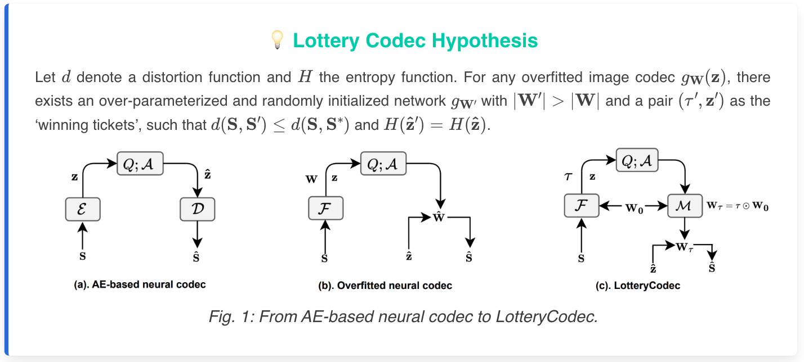
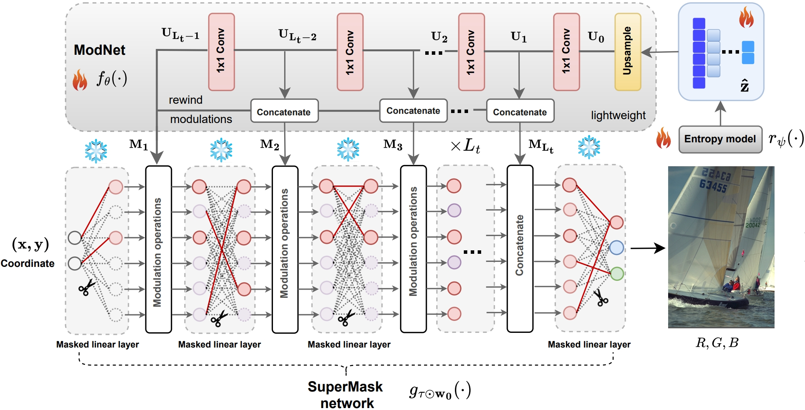

<p align="center">
  
</p>

<h1 align="center">
  LotteryCodec: Searching the Implicit Representation in a Random Network for Low-Complexity Image Compression
</h1>

<p align="center">
  <a href="https://eedavidwu.github.io/">Haotian Wu</a>&nbsp;&nbsp;
  <a href="https://gp-chen.github.io/">Gongpu Chen</a>&nbsp;&nbsp;
  <a href="https://www.commsp.ee.ic.ac.uk/~pld/">Pier Luigi Dragotti</a>&nbsp;&nbsp;
  <a href="https://www.imperial.ac.uk/information-processing-and-communications-lab/people/deniz/">Deniz Gündüz</a>  
  <br/>
  <strong>Imperial College London</strong>
</p>

<p align="center">
  <a href="https://arxiv.org/abs/xxxx.xxxxx" target="_blank">
    
  </a>
  <a href="https://eedavidwu.github.io/LotteryCodec/" target="_blank">
    
  </a>
</p>

## 📣 Latest Updates
- **[2025-06-21]** 📝 *LotteryCodec paper preprint is now available on [arXiv](https://arxiv.org/abs/your-link).*
- **[2025-06-21]** 📝 *Additional resources, such as intermediate results and baseline code, are now released on [resources](https://github.com/eedavidwu/LotteryCodec/blob/master/resource/README.md).*
- **[2025-06-01]** 🎉 *LotteryCodec has been accepted to **ICML 2025** as a **Spotlight**!*

## 🔑 Key Takeaways

- **LotteryCodec** introduces a novel overfitted codec for low-complexity image compression. Instead of training a synthesis neural function, LotteryCodec searches for a well-performing subnetwork within a randomly initialized network!

- A **Lottery Codec Hypothesis** is introduced: Win a lottery ticket as your image codec!


<p align="center">
  
</p>

- To simplify the searching process and improve the performance, **LotteryCodec** employs a modulation-based new paradigm.


<p align="center">
  
</p>

## About this code
The Hypo3D codebase is written in Python and provides simple modules for benchmarking 10 Foundation models, including LLM, 2D VLMs, and 3D VLMs. The core module structure is as follows:
```
Hypo3D/
├── LLM/                          # Storing scripts for LLM models that use scene captions as input for 3D scene processing.
│   ├── GPT4o-text.               # Folder for evaluating GPT4o in text-only mode.
│   ├── llama/                    # Folder for evaluating LLama3.2 3B.
├── 2D-VLM/                       # Storing scripts for 2D-VLM models that use top-view maps as input for 3D scene processing.
│   ├── Claude/                   # Folder for evaluating Claude 3.5 Sonnet.
│   ├── GPT4o/                    # Folder for evaluating GPT4o in vison-language mode.
│   ├── Qwen2-VL/                 # Folder for evaluating Qwen2-VL 7B and 72B.
│   ├── llava-ov/                 # Folder for evaluating LLaVA-OV 7B and 72B.
├── 3D-VLM/                       # Storing scripts for 2D-VLM models that use point cloud/multi-view images as input for 3D scene processing.
│   ├── LLaVA-3D/                 # Folder for evaluating LLaVA-3D model 7B.
│   └── LEO/ (coming soon)        # Folder for evaluating LEO model 7B.
├── exp/                          # Experiemental results for various models.
├── metric_compute.py             # Compute exact match/partial match for each context change category.
├── ...

```

## Contact
- Haotian Wu: haotian.wu17@imperial.ac.uk

Please open an issue or submit a pull request for issues, or contributions.

## 💼 License

<a href="https://opensource.org/licenses/MIT" target="_blank" rel="noopener noreferrer">
  
</a>

## Citation

If you find our resource/idea is helpful, please cite our paper:

```
  @article{LotteryCodec,
    title={LotteryCodec: Searching the Implicit Representation in a Random Network for Low-Complexity Image Compression},
    author={Haotian Wu, Gongpu Chen, Pier Luigi Dragotti, and Deniz Gündüz},
    journal={International Conference on Machine Learning (ICML) 2025},
    year={2025}
  }

```

