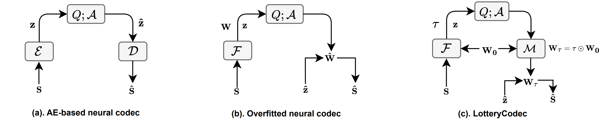

<p align="center">
  
</p>

<h1 align="center">
  LotteryCodec: Searching the Implicit Representation in a Random Network for Low-Complexity Image Compression
</h1>

<p align="center">
  <a href="https://eedavidwu.github.io/">Haotian Wu</a>&nbsp;&nbsp;
  <a href="https://gp-chen.github.io/">Gongpu Chen</a>&nbsp;&nbsp;
  <a href="https://www.commsp.ee.ic.ac.uk/~pld/">Pier Luigi Dragotti</a>&nbsp;&nbsp;
  <a href="https://www.imperial.ac.uk/information-processing-and-communications-lab/people/deniz/">Deniz Gündüz</a>  
  <br/>
  <strong>Imperial College London</strong>
</p>

<p align="center">
  <a href="https://arxiv.org/abs/xxxx.xxxxx" target="_blank">
    
  </a>
  <a href="https://eedavidwu.github.io/LotteryCodec/" target="_blank">
    
  </a>
</p>

## 📣 Latest Updates
- **[2025-06-21]** 📝 *LotteryCodec paper preprint is now available on [arXiv](https://arxiv.org/abs/your-link).*
- **[2025-06-21]** 📝 *Additional resources, such as intermediate results and baseline code, are now released on [resources](https://github.com/eedavidwu/LotteryCodec/blob/master/resource/README.md).*
- **[2025-06-01]** 🎉 *LotteryCodec has been accepted to **ICML 2025** as a **Spotlight**!*

## 🔑 Key Takeaways

- **LotteryCodec** introduces a novel overfitted codec for low-complexity image compression.

---

### 💡 Lottery Codec Hypothesis

Let \( d \) denote a distortion function and \( H \) the entropy function.  
For any overfitted image codec \( g_{\mathbf{W}}(\mathbf{z}) \),  
there exists an over-parameterized and randomly initialized network \( g_{\mathbf{W'}} \)  
with \( |\mathbf{W'}| > |\mathbf{W}| \) and a pair \( (\mathbf{\tau'}, \mathbf{z'}) \) as the “winning tickets”,  
such that:

\[
d(\mathbf{S}, \mathbf{S}') \le d(\mathbf{S}, \mathbf{S}^*) \quad \text{and} \quad H(\hat{\mathbf{z}}') = H(\hat{\mathbf{z}})
\]

---

<p align="center">
  
</p>

<p align="center"><em>Fig. 1: From AE-based neural codec to LotteryCodec.</em></p>


## About this code
The Hypo3D codebase is written in Python and provides simple modules for benchmarking 10 Foundation models, including LLM, 2D VLMs, and 3D VLMs. The core module structure is as follows:
```
Hypo3D/
├── LLM/                          # Storing scripts for LLM models that use scene captions as input for 3D scene processing.
│   ├── GPT4o-text.               # Folder for evaluating GPT4o in text-only mode.
│   ├── llama/                    # Folder for evaluating LLama3.2 3B.
├── 2D-VLM/                       # Storing scripts for 2D-VLM models that use top-view maps as input for 3D scene processing.
│   ├── Claude/                   # Folder for evaluating Claude 3.5 Sonnet.
│   ├── GPT4o/                    # Folder for evaluating GPT4o in vison-language mode.
│   ├── Qwen2-VL/                 # Folder for evaluating Qwen2-VL 7B and 72B.
│   ├── llava-ov/                 # Folder for evaluating LLaVA-OV 7B and 72B.
├── 3D-VLM/                       # Storing scripts for 2D-VLM models that use point cloud/multi-view images as input for 3D scene processing.
│   ├── LLaVA-3D/                 # Folder for evaluating LLaVA-3D model 7B.
│   └── LEO/ (coming soon)        # Folder for evaluating LEO model 7B.
├── exp/                          # Experiemental results for various models.
├── metric_compute.py             # Compute exact match/partial match for each context change category.
├── ...

```

### Download the Hypo3D Benchmark
1. Clone the repository recursively.
   ```
   git clone --recursive https://github.com/MatchLab-Imperial/Hypo3D.git
   ```
3. Download 3D scene representations in Hypo3D dataset
   ```
   git clone https://huggingface.co/datasets/MatchLab/Hypo3D
   mv Hypo3D dataset # rename dataset folder
   cd dataset
   ```
   Expected data folder format:
   ```
    dataset/
    ├── LLM_data/                                          # Scene captions for Large Language Models (e.g., LLama3.2)
    ├── 2D_VLM_data/                                       # Scene Top-View Maps for 2D Vision-Language Models (e.g., GPT4o)
    │   ├── top_view_no_label_rotated/                     # Non-semantic top-view map.
    │   ├── top_view_with_label_rotated/                   # Semantic top-view map.
    ├── 3D_VLM_data/                                       # 3D Scene Data for 3D Vision-Language Models (e.g., LLaVA-3D)
  
    ```
### 📊 Hypo3D: EM (Exact Match) / PM (Partial Match) Accuracy of Foundation Models

| Model Family                    | Model                  | EM (%) | PM (%) |
|--------------------------------|------------------------|--------|--------|
| **LLM (Scene Caption)**        | Llama-3.2 3B           | 26.08  | 29.91  |
|                                | GPT-4o API (Text)      | **35.54**  | **39.65**  |
| **2D VLM (Non-Semantic Map)**  | Qwen2-VL 7B            | 29.68  | 34.47  |
|                                | Qwen2-VL 72B           | 33.39  | 37.51  |
|                                | LLaVA-OV 7B            | 30.62  | 34.34  |
|                                | LLaVA-OV 72B           | **36.38**  | **40.13**  |
|                                | Claude 3.5 Sonnet API  | 20.70  | 30.12  |
|                                | GPT-4o API             | 33.58  | 36.75  |
| **2D VLM (Semantic Map)**      | Qwen2-VL 7B            | 34.40  | 38.91  |
|                                | Qwen2-VL 72B           | 42.45  | 48.25  |
|                                | LLaVA-OV 7B            | 38.93  | 43.51  |
|                                | LLaVA-OV 72B           | 43.81  | 46.83  |
|                                | Claude 3.5 Sonnet API  | 41.36  | 51.59  |
|                                | GPT-4o API             | **45.50**  | **48.82**  |
| **3D VLM (RGB-D Video/Point Cloud)**       | LEO 7B                 | 14.83  | 22.40  |
|                                | LLaVA-3D 7B            | **31.56**  | **35.23**  |
| **Human**                      |                        | 91.00  | 92.50  |


## Contact
- Ye Mao: haotian.wu17@imperial.ac.uk

Please open an issue or submit a pull request for issues, or contributions.

## 💼 License

<a href="https://opensource.org/licenses/MIT" target="_blank" rel="noopener noreferrer">
  
</a>

## Citation

If you find our resource/idea is helpful, please cite our paper:

```
  @article{LotteryCodec,
    title={LotteryCodec: Searching the Implicit Representation in a Random Network for Low-Complexity Image Compression},
    author={Haotian Wu, Gongpu Chen, Pier Luigi Dragotti, and Deniz Gündüz},
    journal={International Conference on Machine Learning (ICML) 2025},
    year={2025}
  }

```

